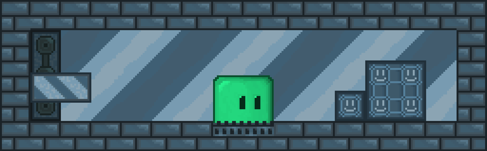

# Sqime

## This is a game
---

I'm Vaniog, my discord: <b>Vaniog#1886</b>
---
## Table of Contents:
- #### [Description](#description)
- #### [Playing](#playing)
- #### [Building](#building)
---
## Description
This is my old project, so here it is,
bad code, bad file organization and much more.
But the game is not so bad.
I cleaned as much as I can, I added README, CMakeLists,
and I deleted trash from repository.
If sometime I'll want to return to this game, I'll write
it form scratch.

---
## Playing
### In game:
> moving - <b>w, a, s, d</b> \
> restart level - <b>r</b>

### In creating mode
Your created level will be saved at maps/level00.txt, share it!
> #### <u>Main</u>
>- new field - <b>n</b> 
>- try level - <b>t</b> 
>- field size change - <b>arrows up and down</b> 
>- to choose tile to draw - <b>buttons on left sight</b> 
>- to change tile rotation - <b>double-click on tile button</b>

> #### How to make <u>slime</u>
>- Push slime button 
>- Choose size 
>- Choose coords (you can see coords in top-right corner)

> #### How to make <u>platforms</u>:
>- Push platform button 
>- Choose size 
>- Choose starting and ending coords 
>- Choose speed

> #### How to make <u>box</u>
>- Look at [how to make slime](#how-to-make-slime)

> #### How to make <u>buttons</u>
> <i>Carefully! code is bad, create buttons after other objects</i> 
>- Push button button 
>- Choose platform to control 
>- Choose where will platform go on off-mode on-mode 
>- Choose mode of button (just experiment with it) 
>- Choose size, and when choose coords
 ---
## Building
This project is running Simple Fast Multimedia Library
(SFML) \
SFML: [Github](https://github.com/SFML/SFML) [Website](https://www.sfml-dev.org/)

- [Linux](#Linux)
- [Windows](#playing)
- [MacOS](#macos)

### Linux
    #installing cmake
    sudo apt-get install cmake

    #installing sfml library
    sudo apt-get install libsfml-dev

    #clone github project
    git clone https://github.com/Vaniog/Sqime
    cd Sqime

    #building project
    mkdir build && cd build
    cmake -DCMAKE_BUILD_TYPE=Release ..
    make
    
    #and launch
    cd ..
    build/Sqime

### MacOS
    #inctalling cmake
    brew install cmake

    #installing sfml library
    brew install sfml

    #clone github project
    git clone https://github.com/Vaniog/Sqime
    cd Sqime

    #building project
    mkdir build && cd build
    cmake -DCMAKE_BUILD_TYPE=Release ..
    make
    
    #and launch
    cd ..
    build/Sqime